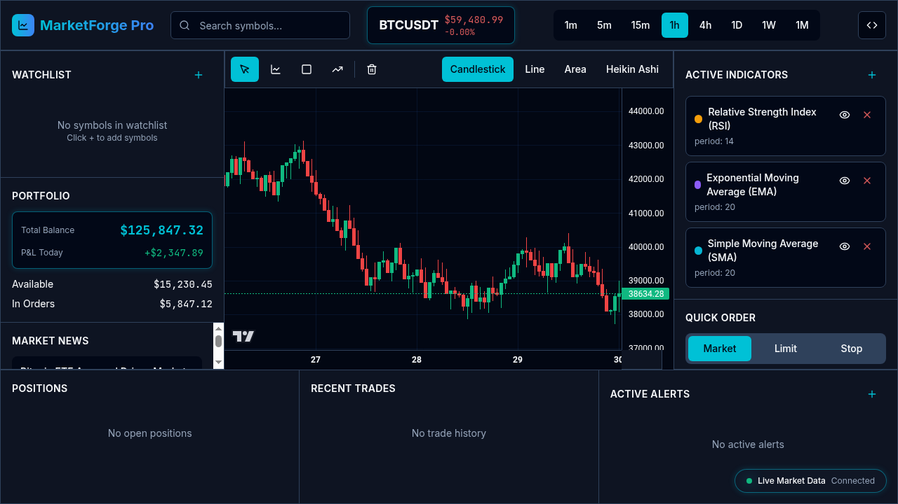

<div align="center">



# 📈 MarketForge-Pro

### *Free Open-Source TradingView Alternative*

[](LICENSE)
[](https://www.python.org/downloads/)
[](https://reactjs.org/)
[](CONTRIBUTING.md)
[](https://github.com/xtoor/marketforge-pro/stargazers)
[](https://github.com/xtoor/marketforge-pro/network/members)
[](https://github.com/xtoor/marketforge-pro/issues)
[](https://github.com/xtoor/marketforge-pro)

**MarketForge-Pro** is a powerful, free, and open-source trading analysis platform designed for traders who want professional-grade charting without premium subscription fees. Built with Python and React, it offers advanced technical analysis capabilities with Python-based strategy development instead of Pine Script.

[Features](#-features) • [Installation](#-installation) • [Usage](#-usage) • [Contributing](#-contributing) • [Roadmap](#-roadmap)

</div>

---

## 🌟 Features

- **📊 Advanced Charting**: Professional-grade candlestick charts with multiple timeframes
- **🐍 Python Strategy Editor**: Write trading strategies in Python for unlimited flexibility
- **📈 Technical Indicators**: Comprehensive library of built-in technical analysis indicators
- **💰 Cost-Free**: 100% free and open-source - no premium subscriptions required
- **🔧 Highly Customizable**: Fully customizable workspace and chart layouts
- **📱 Modern UI**: Clean, intuitive React-based interface
- **🔄 Real-time Data**: Support for live market data feeds
- **💾 Strategy Backtesting**: Test your strategies on historical data
- **📊 Multiple Asset Classes**: Stocks, Forex, Crypto, and more

---

## 🚀 Installation

### Prerequisites

Before installing MarketForge-Pro, ensure you have the following installed:

- **Python 3.8+** - [Download Python](https://www.python.org/downloads/)
- **Node.js 16+** - [Download Node.js](https://nodejs.org/)
- **npm or yarn** - Comes with Node.js
- **Git** - [Download Git](https://git-scm.com/)

### Quick Start

1. **Clone the repository**
   ```bash
   git clone https://github.com/xtoor/marketforge-pro.git
   cd marketforge-pro
   ```

2. **Backend Setup (Python)**
   ```bash
   # Create virtual environment
   python -m venv venv
   
   # Activate virtual environment
   # On Windows:
   venv\Scripts\activate
   # On macOS/Linux:
   source venv/bin/activate
   
   # Install dependencies
   pip install -r requirements.txt
   ```

3. **Frontend Setup (React)**
   ```bash
   # Navigate to frontend directory
   cd frontend
   
   # Install dependencies
   npm install
   # or
   yarn install
   ```

4. **Configuration**
   ```bash
   # Copy example environment file
   cp .env.example .env
   
   # Edit .env with your settings
   nano .env
   ```

5. **Run the Application**
   
   **Terminal 1 - Backend:**
   ```bash
   python app.py
   # or
   python manage.py runserver
   ```
   
   **Terminal 2 - Frontend:**
   ```bash
   cd frontend
   npm start
   # or
   yarn start
   ```

6. **Access the Application**
   
   Open your browser and navigate to: `http://localhost:3000`

---

## 📖 Usage

### Creating Your First Strategy

1. **Open Strategy Editor**: Click on the "Strategy" tab in the main interface
2. **Write Your Strategy**: Use Python to define your trading logic
   ```python
   def strategy(data):
       # Example: Simple Moving Average Crossover
       sma_fast = data['close'].rolling(window=10).mean()
       sma_slow = data['close'].rolling(window=30).mean()
       
       if sma_fast[-1] > sma_slow[-1]:
           return "BUY"
       elif sma_fast[-1] < sma_slow[-1]:
           return "SELL"
       return "HOLD"
   ```
3. **Backtest**: Run backtests to evaluate strategy performance
4. **Deploy**: Apply your strategy to live charts

### Adding Indicators

- Click the "Indicators" button on the chart
- Search for your desired indicator
- Customize parameters and apply to chart

---

## 📊 Project Progress

### ✅ Completed Features

- [x] Basic charting functionality
- [x] Python-based backend architecture
- [x] React frontend framework
- [x] Strategy editor interface
- [x] Basic technical indicators
- [x] Data visualization components

### 🔄 In Progress

- [ ] Advanced backtesting engine
- [ ] Real-time data integration
- [ ] User authentication system
- [ ] Portfolio management features
- [ ] Enhanced indicator library
- [ ] Mobile responsive design

### 📈 Development Status

| Component | Status | Completion |
|-----------|--------|------------|
| Backend API | 🟡 In Progress | 70% |
| Frontend UI | 🟡 In Progress | 65% |
| Strategy Engine | 🟡 In Progress | 60% |
| Data Pipeline | 🟢 Functional | 80% |
| Documentation | 🟡 In Progress | 40% |
| Testing Suite | 🔴 Planned | 20% |

---

## 🗺️ Roadmap

### Phase 1: Core Functionality (Current)
- ✅ Basic charting capabilities
- ✅ Python strategy editor
- 🔄 Essential technical indicators
- 🔄 Historical data integration

### Phase 2: Advanced Features (Q4 2024)
- 📋 Real-time market data feeds
- 📋 Advanced backtesting with metrics
- 📋 Multi-timeframe analysis
- 📋 Alert system and notifications
- 📋 Portfolio tracking and analysis

### Phase 3: Community & Collaboration (Q1 2025)
- 📋 Strategy marketplace
- 📋 Social trading features
- 📋 Community strategy sharing
- 📋 Cloud strategy storage
- 📋 Collaborative workspaces

### Phase 4: Enterprise Features (Q2 2025)
- 📋 API for third-party integrations
- 📋 Advanced risk management tools
- 📋 Institutional-grade features
- 📋 Custom data source connections
- 📋 Machine learning strategy tools

---

## 🤝 Contributing

We welcome contributions from the community! MarketForge-Pro is an ongoing project with known bugs and missing features.

### How to Contribute

1. **Fork the repository**
2. **Create a feature branch** (`git checkout -b feature/AmazingFeature`)
3. **Commit your changes** (`git commit -m 'Add some AmazingFeature'`)
4. **Push to the branch** (`git push origin feature/AmazingFeature`)
5. **Open a Pull Request**

### Contribution Guidelines

- Write clean, documented code
- Follow existing code style and conventions
- Add tests for new features
- Update documentation as needed
- Be respectful and constructive in discussions

### Areas Where We Need Help

- 🐛 Bug fixes and testing
- 📚 Documentation improvements
- 🎨 UI/UX enhancements
- 🔧 New indicator implementations
- 🌐 Internationalization
- 📊 Data source integrations

---

## 🛠️ Tech Stack

### Backend
- **Python 3.8+**: Core backend language
- **Flask/FastAPI**: Web framework
- **Pandas**: Data manipulation
- **NumPy**: Numerical computations
- **TA-Lib**: Technical analysis library

### Frontend
- **React 18+**: UI framework
- **TypeScript**: Type-safe JavaScript
- **TradingView Lightweight Charts**: Charting library
- **Tailwind CSS**: Styling framework
- **Redux**: State management

### Database
- **PostgreSQL**: Primary database
- **Redis**: Caching layer

---

## 📄 License

This project is licensed under the MIT License - see the [LICENSE](LICENSE) file for details.

---

## 📞 Contact & Support

- **Issues**: [GitHub Issues](https://github.com/xtoor/marketforge-pro/issues)
- **Discussions**: [GitHub Discussions](https://github.com/xtoor/marketforge-pro/discussions)
- **Email**: support@marketforge-pro.dev

---

## ⚠️ Disclaimer

MarketForge-Pro is currently under active development and may contain bugs and incomplete features. This software is provided for educational and research purposes. Trading in financial markets involves risk, and you should not trade with money you cannot afford to lose. The developers are not responsible for any financial losses incurred while using this software.

---

## 🙏 Acknowledgments

- TradingView for inspiration
- The open-source community for various libraries and tools
- All contributors who help make this project better

---

<div align="center">

**⭐ Star this repository if you find it useful! ⭐**

Made with ❤️ by the MarketForge-Pro community

[⬆ Back to Top](#-marketforge-pro)

</div>
